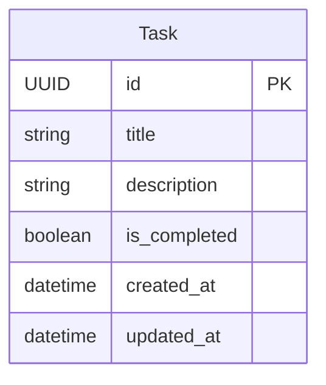
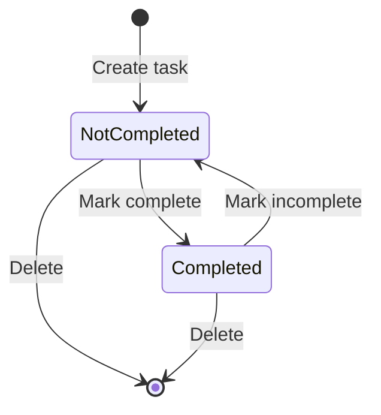

# Data Model: Task Management API

**Feature**: 001-task-api
**Date**: 2026-01-13
**Phase**: Phase 1 - Design

## Entity Overview

The system manages a single core entity: **Task**



---

## Entity: Task

Represents a single unit of work to be tracked by the user.

### Fields

| Field | Type | Constraints | Default | Description |
|-------|------|-------------|---------|-------------|
| `id` | UUID | PRIMARY KEY, NOT NULL | `uuid4()` | Unique identifier (system-generated) |
| `title` | String | NOT NULL, 1-200 chars | - | Brief description of the work |
| `description` | String | NULLABLE | NULL | Detailed information about the task |
| `is_completed` | Boolean | NOT NULL | `false` | Completion status |
| `created_at` | DateTime | NOT NULL | `now()` | Timestamp when task was created |
| `updated_at` | DateTime | NOT NULL | `now()` | Timestamp of last modification |

### Validation Rules

From functional requirements (spec.md):

1. **Title Validation** (FR-010):
   - MUST NOT be empty string
   - MUST NOT be whitespace-only
   - MUST be 1-200 characters after trimming
   - Leading/trailing whitespace trimmed on input

2. **Description Validation**:
   - Optional (can be NULL)
   - No length limit (within reason for UI/UX)
   - Whitespace preserved (not trimmed)

3. **Completion Status**:
   - Boolean only (true/false)
   - Defaults to `false` on creation

4. **Timestamps**:
   - `created_at`: Set once at creation, immutable
   - `updated_at`: Updated on any modification
   - UTC timezone
   - ISO 8601 format in API

### State Transitions



**States**:
- `is_completed = false`: Task is not yet done (initial state)
- `is_completed = true`: Task is finished

**Transitions**:
- **Create**: Task enters system with `is_completed = false`
- **Mark Complete**: User updates `is_completed` to `true`
- **Mark Incomplete**: User updates `is_completed` to `false` (re-open)
- **Delete**: Task permanently removed from system
- **Update**: Title or description changes do not affect completion state

---

## Database Schema

### PostgreSQL DDL

```sql
CREATE EXTENSION IF NOT EXISTS "uuid-ossp";

CREATE TABLE task (
    id UUID PRIMARY KEY DEFAULT uuid_generate_v4(),
    title VARCHAR(200) NOT NULL,
    description TEXT,
    is_completed BOOLEAN NOT NULL DEFAULT FALSE,
    created_at TIMESTAMP NOT NULL DEFAULT CURRENT_TIMESTAMP,
    updated_at TIMESTAMP NOT NULL DEFAULT CURRENT_TIMESTAMP
);

-- Index for common queries
CREATE INDEX idx_task_created_at ON task(created_at DESC);
CREATE INDEX idx_task_is_completed ON task(is_completed);

-- Trigger to auto-update updated_at
CREATE OR REPLACE FUNCTION update_updated_at_column()
RETURNS TRIGGER AS $$
BEGIN
    NEW.updated_at = CURRENT_TIMESTAMP;
    RETURN NEW;
END;
$$ language 'plpgsql';

CREATE TRIGGER update_task_updated_at BEFORE UPDATE ON task
    FOR EACH ROW EXECUTE FUNCTION update_updated_at_column();
```

### SQLModel Implementation

```python
from sqlmodel import Field, SQLModel
from datetime import datetime
from uuid import UUID, uuid4

class Task(SQLModel, table=True):
    """
    Task entity for tracking work items.

    Represents a single unit of work with title, optional description,
    and completion status. Automatically tracks creation and modification times.
    """
    id: UUID = Field(
        default_factory=uuid4,
        primary_key=True,
        nullable=False,
        description="Unique task identifier"
    )

    title: str = Field(
        max_length=200,
        nullable=False,
        description="Brief description of the work (1-200 chars)"
    )

    description: str | None = Field(
        default=None,
        nullable=True,
        description="Detailed information about the task"
    )

    is_completed: bool = Field(
        default=False,
        nullable=False,
        description="Completion status (false = not done, true = done)"
    )

    created_at: datetime = Field(
        default_factory=datetime.utcnow,
        nullable=False,
        description="UTC timestamp when task was created"
    )

    updated_at: datetime = Field(
        default_factory=datetime.utcnow,
        nullable=False,
        sa_column_kwargs={"onupdate": datetime.utcnow},
        description="UTC timestamp of last modification"
    )
```

---

## Relationships

### Current Scope
No relationships in MVP. Task is a standalone entity.

### Future Considerations (Out of Scope)
Potential relationships for future features:
- `User` → `Task` (one-to-many): User ownership
- `Task` → `Tag` (many-to-many): Categorization
- `Task` → `Comment` (one-to-many): Task notes/history

---

## Indexes

### Primary Index
- `id` (UUID): Primary key, clustered

### Secondary Indexes
1. **created_at (DESC)**: Optimize default task list sorting (newest first)
2. **is_completed**: Filter completed vs incomplete tasks efficiently

### Index Strategy
- Keep indexes minimal for MVP (write performance)
- Add indexes based on query patterns if performance issues arise
- Monitor slow queries and add indexes as needed

---

## Data Integrity Rules

### Database Level
1. **NOT NULL constraints**: `id`, `title`, `is_completed`, `created_at`, `updated_at`
2. **PRIMARY KEY constraint**: `id` uniqueness enforced
3. **CHECK constraints**: None needed (application-level validation sufficient)

### Application Level
1. **Title validation**: Non-empty, non-whitespace, 1-200 chars (enforced in Pydantic schema)
2. **UUID generation**: Application generates UUID on creation (not database default)
3. **Timestamp management**: Application sets `created_at`, updates `updated_at`

### Why Application-Level Validation?
- FastAPI/Pydantic provides excellent validation with clear error messages
- Easier to test validation logic
- Better user feedback (field-specific errors vs generic DB errors)
- Database constraints as backup/safety net

---

## Query Patterns

Based on functional requirements:

### 1. Create Task (FR-001, FR-002, FR-003, FR-004)
```sql
INSERT INTO task (id, title, description, is_completed, created_at, updated_at)
VALUES ($1, $2, $3, false, CURRENT_TIMESTAMP, CURRENT_TIMESTAMP)
RETURNING *;
```

### 2. List All Tasks (FR-005)
```sql
SELECT * FROM task
ORDER BY created_at DESC;
```

### 3. Get Task by ID (FR-006)
```sql
SELECT * FROM task
WHERE id = $1;
```

### 4. Update Task (FR-007, FR-008)
```sql
UPDATE task
SET title = $2, description = $3, is_completed = $4, updated_at = CURRENT_TIMESTAMP
WHERE id = $1
RETURNING *;
```

### 5. Delete Task (FR-009)
```sql
DELETE FROM task
WHERE id = $1;
```

### Performance Expectations
- Single task operations: <50ms (p95)
- List all tasks (up to 1000): <200ms (p95)
- Concurrent operations: 100+ users supported with connection pooling

---

## Migration Strategy

### Initial Setup (MVP)
Use SQLModel's `create_all()` for development:

```python
async def init_db():
    async with engine.begin() as conn:
        await conn.run_sync(SQLModel.metadata.create_all)
```

### Future Migrations (Post-MVP)
When schema changes are needed:

1. Initialize Alembic:
   ```bash
   alembic init alembic
   ```

2. Configure `alembic/env.py` to use SQLModel metadata

3. Generate migrations:
   ```bash
   alembic revision --autogenerate -m "Description of change"
   ```

4. Apply migrations:
   ```bash
   alembic upgrade head
   ```

### Migration Principles
- Never delete columns (add migration to drop)
- Always test migrations on staging first
- Keep migrations reversible when possible
- Commit migrations to version control

---

## Test Data Strategy

### Fixtures for Testing

```python
# tests/conftest.py
import pytest
from uuid import uuid4
from datetime import datetime

@pytest.fixture
def sample_task_data():
    """Valid task data for testing."""
    return {
        "title": "Write documentation",
        "description": "Create API documentation for task endpoints",
        "is_completed": False
    }

@pytest.fixture
def completed_task_data():
    """Completed task data for testing."""
    return {
        "title": "Deploy to production",
        "description": None,
        "is_completed": True
    }

@pytest.fixture
async def created_task(test_session, sample_task_data):
    """Create a task in test database."""
    task = Task(**sample_task_data)
    test_session.add(task)
    await test_session.commit()
    await test_session.refresh(task)
    return task
```

### Edge Cases for Testing
1. Empty title (should fail validation)
2. Whitespace-only title (should fail validation)
3. Title exactly 200 chars (should pass)
4. Title 201 chars (should fail validation)
5. Null description (should pass)
6. Very long description (should pass, no limit)
7. Special characters in title (should pass)
8. Unicode in title/description (should pass)

---

## Summary

**Entity Count**: 1 (Task)
**Relationships**: None (single entity system)
**Validation**: Application-level (Pydantic) with database constraints as backup
**Indexes**: Primary key + 2 secondary indexes for performance
**State Machine**: Simple boolean toggle (is_completed)
**Migration**: Deferred to post-MVP (use create_all() initially)

This data model satisfies all functional requirements (FR-001 through FR-014) while maintaining simplicity and alignment with constitutional principles.
